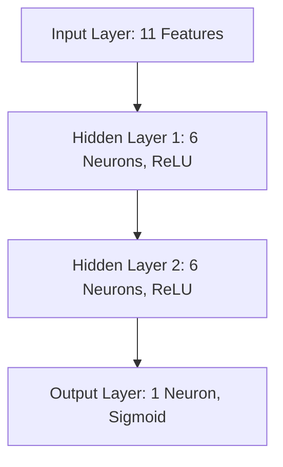
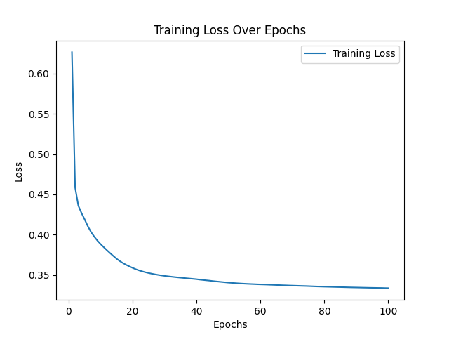
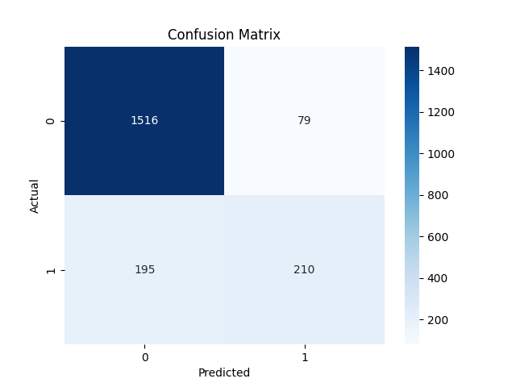
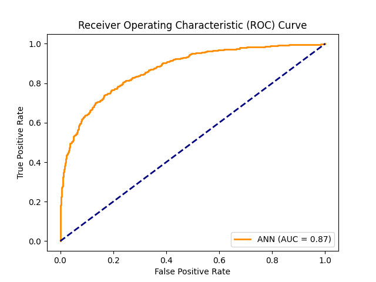

# Artificial Neural Network for Churn Analysis on Bank Customers

## Table of Contents

- [Introduction](#introduction)
- [Model Architecture](#model-architecture)
- [Results](#results)
  - [Training Loss Over Epochs](#training-loss-over-epochs)
  - [Confusion Matrix](#confusion-matrix)
  - [ROC Curve and AUC](#roc-curve-and-auc)
  - [Sample Prediction](#sample-prediction)
- [Discussion](#discussion)
- [Conclusion](#conclusion)
- [References](#references)

## Introduction

This project aims to predict customer churn in a bank using an Artificial Neural Network (ANN). Churn analysis helps banks identify customers who are likely to leave so that proactive measures can be taken to retain them. The dataset contains various features about customers, and the model predicts the probability of a customer leaving the bank.

## Model Architecture

The ANN model consists of an input layer, two hidden layers with ReLU activation functions, and an output layer with a sigmoid activation function. The architecture is as follows:

- **Input Layer**: Accepts 11 features after preprocessing (including one-hot encoding and scaling).
- **Hidden Layers**: Two hidden layers with 6 neurons each, using the ReLU activation function to introduce non-linearity.
- **Output Layer**: Single neuron with a sigmoid activation function to output a probability between 0 and 1.

## Results

### Training Loss Over Epochs

The training loss decreases over the epochs, indicating that the model is learning effectively. The loss values at every 10 epochs are presented in the table below:

| Epoch | Loss    |
|-------|---------|
| 10    | 0.3881  |
| 20    | 0.3587  |
| 30    | 0.3488  |
| 40    | 0.3447  |
| 50    | 0.3404  |
| 60    | 0.3382  |
| 70    | 0.3367  |
| 80    | 0.3354  |
| 90    | 0.3344  |
| 100   | 0.3336  |

This consistent decrease in loss shows that the model's predictions are getting closer to the actual values over time.

### Confusion Matrix

The confusion matrix displays the model's performance on the test set:

- **True Negatives (TN)**: 1,516 (correctly predicted not churn)
- **False Positives (FP)**: 79 (incorrectly predicted churn)
- **False Negatives (FN)**: 195 (incorrectly predicted not churn)
- **True Positives (TP)**: 210 (correctly predicted churn)

**Accuracy:** **86.30%**

The model achieves a high accuracy, correctly predicting the majority of the cases.

### ROC Curve and AUC

The ROC curve illustrates the trade-off between the true positive rate and the false positive rate at various threshold settings. The area under the curve (AUC) is **0.87**, indicating good model performance. A higher AUC represents better model capability to distinguish between customers who will churn and those who will not.

### Sample Prediction

For a specific customer with the following details:

- **Geography**: France
- **Credit Score**: 600
- **Gender**: Male
- **Age**: 40 years old
- **Tenure**: 3 years
- **Balance**: \$60,000
- **Number of Products**: 2
- **Has a Credit Card**: Yes
- **Is an Active Member**: Yes
- **Estimated Salary**: \$50,000

**Model Prediction:**

- **Probability of Churn**: `0.032193172723054886`
- **Churn Prediction**: **False** (The customer is predicted **not to churn**)

The model assigns a low probability of churn (~3.22%) to this customer, indicating they are likely to stay with the bank.

## Discussion

The model demonstrates strong predictive capabilities with an accuracy of **86.30%** on the test set and an AUC of **0.87**. The decreasing training loss over epochs confirms that the model is learning effectively from the data.

However, the confusion matrix reveals that there are more false negatives (195) than false positives (79). This means that the model is more likely to miss predicting customers who will churn. In a business context, false negatives are critical because they represent customers who are likely to leave but are not identified by the model, preventing the bank from intervening.

To address this, future work could involve:

- **Adjusting the Classification Threshold**: Lowering the threshold for predicting churn could reduce false negatives.
- **Class Imbalance Handling**: Techniques like resampling or using class weights can help balance the training data.
- **Hyperparameter Tuning**: Experimenting with different learning rates, batch sizes, and network architectures may improve performance.
- **Feature Engineering**: Adding or transforming features to provide more predictive power.

The sample prediction showcases the model's practical application in assessing individual customers' churn risk, enabling targeted customer retention strategies.

## Conclusion

The ANN model effectively predicts customer churn, providing valuable insights for the bank to retain customers. With high accuracy and a good AUC score, the model can be a useful tool in the bank's customer relationship management. Future enhancements, as discussed, could further improve the model's ability to identify at-risk customers.

## References
1. Machine Learning A-Z: AI, Python & R [2024]  
Created by Hadelin de Ponteves, Kirill Eremenko, SuperDataScience Team, and the Ligency Team  
[https://www.udemy.com/course/machinelearning/](https://www.udemy.com/course/machinelearning/)

